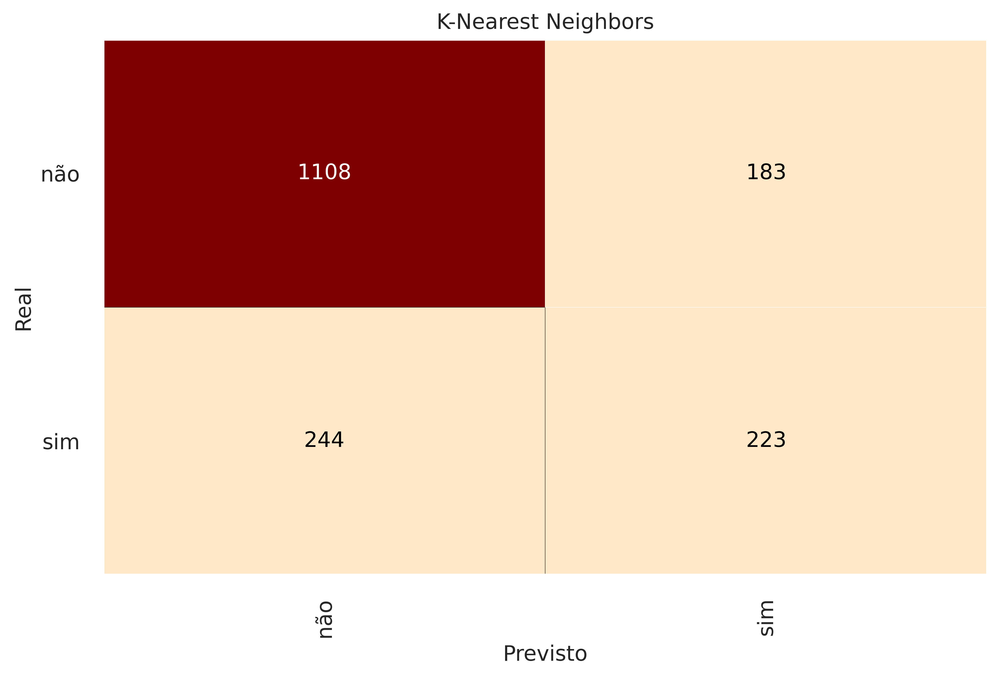
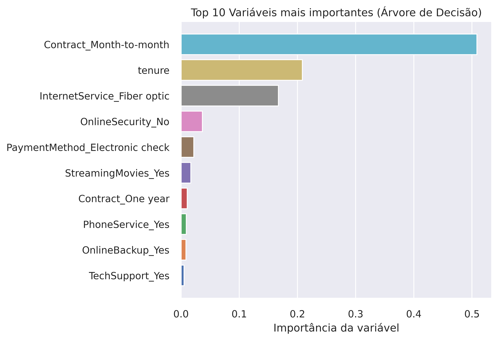
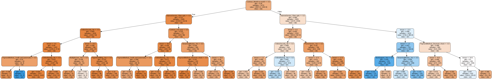

<div align="center">
  <h1>📊 Previsão de evasão na Telecom X: KNN e Árvore de Decisão</h1>
  <h2 align="center">🎓 Projeto Final - Formação em Data Science — Alura e Oracle Next Education (ONE)</h2>
  <p>
    <em>Uma análise comparativa de modelos de Machine Learning para identificar e entender a evasão de clientes (Churn).</em>
  </p>
</div>


<br>
<div align="left">
  <a href="https://www.python.org/">
    
  </a>
  <a href="https://jupyter.org/">
    
  </a>
  <a href="https://scikit-learn.org/">
    
  </a>
  <a href="https://pandas.pydata.org/">
    
  </a>
  <a href="https://matplotlib.org/">
    
  </a>
  
  
</div>

<br>

> **Pipeline completo de Machine Learning** para previsão de churn da TelecomX: pré-processamento de dados, tratamento de desbalanceamento, modelagem preditiva avançada comparando os algoritmos **K-Nearest Neighbors (KNN)** e **Árvore de Decisão (Decision Tree)**, avaliação de métricas e extração de insights de negócio. Parte 2 do Challenge Telecom X.

<br>

<h2>📌 O Problema de Negócio</h2>
<p>
  A <strong>TelecomX</strong>, uma empresa fictícia de telecomunicações, vem enfrentando uma alta taxa de evasão de clientes (<em>Churn</em>). O custo de adquirir um novo cliente é muito maior do que reter um atual. Portanto, o objetivo deste projeto foi desenvolver um modelo de <strong>Machine Learning</strong> capaz de identificar padrões de comportamento e prever quais clientes possuem maior probabilidade de cancelar seus serviços, permitindo ações proativas de retenção.
</p>

<h2>🛠️ Tecnologias Utilizadas</h2>

| Tecnologia | Versão | Uso no Projeto |
| :--- | :---: | :--- |
| Python | 3.10+ | Linguagem base dos scripts |
| Pandas | 2.2+ | Manipulação, limpeza e análise exploratória dos dados|
| NumPy | 2.0+ | Operações numéricas |
| Scikit-learn | 1.6+ | Modelos (KNN e Árvore de Decisão), métricas e pré-processamento |
| Matplotlib | 3.10+ | Criação de gráficos estáticos e customizados |
| Seaborn | 0.13+ | Visualização estatística de dados |
| Google Colab | — | Ambiente de desenvolvimento e execução do notebook |
| Git/GitHub | — | Controle de versão e hospedagem |

<h2>⚙️ Metodologia e Pipeline</h2>
<ol>
  <li><strong>Tratamento e Transformação:</strong> Aplicação de <code>OneHotEncoder</code> e <code>StandardScaler</code> para normalização das variáveis numéricas, garantindo menor impacto em K-Nearest Neighbors (modelo sensível à escalas).</li>
  <li><strong>Otimização (Hyperparameter Tuning):</strong> Uso do <code>GridSearchCV</code> focado na métrica <em>F1-Score</em> para encontrar os melhores hiperparâmetros e lidar com o desbalanceamento das classes.</li>
</ol>

<h2>📈 Análise e Resultados dos Modelos</h2>
<p>
  A <strong>Árvore de Decisão Otimizada</strong> apresentou um desempenho superior, alcançando um <em>Recall</em> de <strong>0.578</strong> (identificando corretamente quase 60% dos clientes prestes a cancelar) e mantendo uma Precisão na casa dos <strong>85%</strong> para a classe majoritária ("não").
</p>

<h3>Comparativo de Métricas</h3>

| Modelo | Evasão (Churn) | Precisão | Recall | F1-Score |
| :--- | :---: | :---: | :---: | :---: |
| 🌳 **Árvore de Decisão** | `sim` | 0.588 | **0.578** | **0.583** |
| 🌳 **Árvore de Decisão** | `não` | 0.848 | 0.854 | 0.851 |
| 📏 **KNN** | `sim` | 0.549 | 0.478 | 0.511 |
| 📏 **KNN** | `não` | 0.820 | 0.858 | 0.838 |


<div align="center">
  <h3>Matrizes de Confusão</h3>
      
      
</div>

<p>Na análise de interpretabilidade das variáveis mais importantes (<em>Feature Importance</em>), os modelos apresentaram estratégias diferentes de decisão:</p>

<ul>
  <li>🌳 <strong>Árvore de Decisão:</strong> Focou esmagadoramente em três fatores principais (Contrato Mensal, Tempo de Permanência e Internet Fibra Ótica), criando regras rígidas de corte.</li>

  <li>📏 <strong>KNN:</strong> Apresentou uma distribuição mais equilibrada, considerando o pacote de serviços como um todo (Segurança Online, Múltiplas Linhas) e as Cobranças Totais para encontrar perfis similares.</li>
</ul>

<div align="center">
  <h3>Visualização das Importâncias (Feature Importance)</h3>
  <p><i>Comparativo: Árvore de Decisão x KNN</i></p>
  
  
  
</div>

<div align="center">
  <h3>Estrutura da Árvore de Decisão Gerada</h3>
  
  <div align="center">
  
</div>


<h2>🚀 Como Rodar este Projeto</h2>
<p>Siga os passos abaixo para testar os modelos localmente na sua máquina:</p>

```bash
# 1. Clone este repositório
git clone [https://github.com/GuilhermeFernandez/TelecomX_2.git](https://github.com/GuilhermeFernandez/TelecomX_2.git)

# 2. Acesse a pasta do projeto
cd TelecomX_2

# 3. Instale as dependências exatas utilizando o arquivo requirements.txt
pip install -r requirements.txt

``` 
<p>Após a instalação, basta abrir o arquivo <code>.ipynb</code> no Jupyter Notebook ou VS Code e executar as células sequencialmente.</p>

<div align="center">
<p>Autor</p>
<a href="https://github.com/GuilhermeFernandez">
        
        <br>
        <sub><b>Guilherme Honório Fernández</b></sub>
